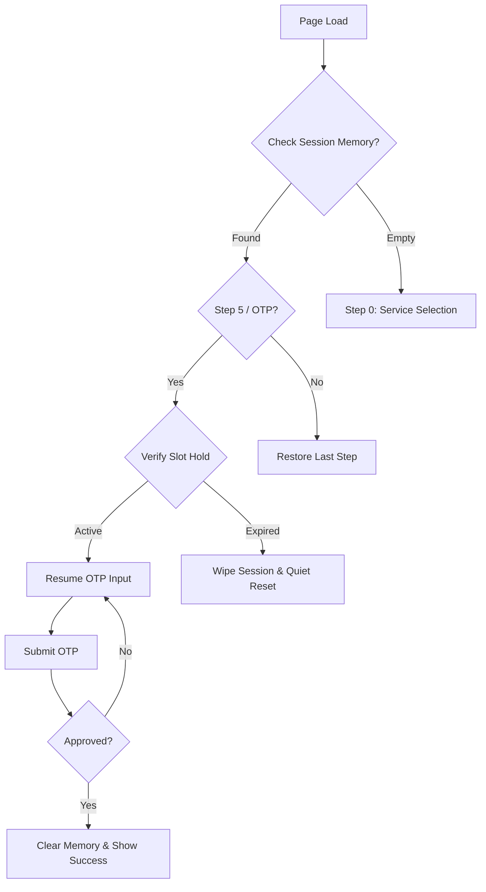

# Guest Booking Resilience & Recovery Architecture

This document outlines the logic and implementation strategy for ensuring the Guest Booking Wizard is resilient to accidental page reloads, tab closures, and session interruptions.

---

## 🎯 Objectives

1. **Zero Data Loss:** Prevent users from re-entering information after an accidental refresh.
2. **State Persistence:** Maintain the wizard's current step and form data across browser sessions.
3. **Session Security:** Protect slot holds with a synchronized server-side TTL.
4. **Intuitive Recovery:** Provide a seamless "Resume" experience while handling expired states gracefully.

---

## 🛠 Core Logic Flow

---

## 📋 Implementation Details

### 1. Browser Memory (Persistence Layer)

As the user progresses through the wizard, state is mirrored to `localStorage`.

- **Scope:** Survives page refreshes and browser restarts.
- **Data Points:** `step`, `formData`, `verificationToken`, `sessionId`, `failedOtpAttempts`, and `otpResendCount`.

### 2. The "Single Source of Truth" Timer

The countdown begins the moment a slot is selected and is the **Total Transaction Time**.

- **Duration:** 10 Minutes.
- **Consistency:** The timer carries through all steps past the selection.
- **Visual Urgency:** A persistent countdown and progress bar are shown in the header.

### 3. The "Recovery Interceptor"

On initialization, the wizard checks `localStorage`.

- **Active Hold:** If an active hold is found, the **Recovery Modal** asks: "Would you like to continue or start fresh?"
- **Expired Hold:** If the hold is expired, the system performing a **Quiet Reset** (clears date/time but keeps personal info) and drops the user at Step 1 (DateTime).

### 4. Guard Rails & Redirections

| Scenario | Action | UX Outcome |
| :--- | :--- | :--- |
| **Accidental Refresh** | Load `localStorage` | User stays on the same step or sees Recovery Modal. |
| **Full Reset (Recovery/Block)** | `handleReset()` | Fully releases hold, clears **all** memory (shared computer safety). |
| **Partial Reset (OTP Step)** | `handlePartialReset()` | Releases hold but **keeps personal info**; returns to Step 1. |
| **Expired Slot (during session)**| `setShowExpiryModal(true)` | Redirects to Step 1 with a choice to pick a new time or start fresh. |
| **OTP Hard Block** | `showBlockModal` | Locked screen after 5 failed attempts. |

---

## 🛡️ OTP Security & Rate Limiting

To protect against brute-force attacks and email spam, the wizard enforces strict rate limiting:

### Hard Block (5 Failed Attempts)
- If a user enters the wrong OTP code **5 times**, they are hit with a **"Too Many Attempts"** modal.
- **Friendly UX:** Before the block hits, the error message dynamically shows **"X attempts remaining"** to warn the user.
- This modal locks the session. The user must either **"Restart Booking"** (releases hold and clears all info) or return to the **Homepage**.
- This state is persisted in `localStorage`, so refreshing the page will not bypass the block.

### UX: Partial vs. Full Reset
The system intelligently distinguishes between "Starting Over" for convenience vs. security:

- **Convenience (Partial):** Triggered from the "Start Over" button on the OTP screen. It assumes the user just wants a different time. We keep their name/email/phone to reduce friction.
- **Security (Full):** Triggered from the **Hard Block Modal** (after 5 fails) or the Recovery Modal. 
    - **Rationale:** If an OTP is failed 5 times, we treat the session as potentially compromised or abandoned. A full wipe ensures that a previous user's personal information (Name, Phone, Email) does not linger in the browser for the next person using a shared computer.

### Exponential Resend Cooldown
- The "Resend Code" button timer increases each time it is clicked to prevent email spam.
- **Sequence:** 30s → 60s → 60s → 120s → 180s → 300s.
- This ensures users are forced to wait longer between attempts if they are having delivery issues.

---

## 🧪 Verification Scenarios (Testing Guide)

### 1. The "Safety Net" (Persistence)
- **Action:** Fill in Info (Step 2), then **Refresh**.
- **Expected:** Recovery Modal appears. "Continue" restores all data.

### 2. The "Fake Expiry" Guard
- **Action:** Reach OTP, click "Start Over," then pick a new time.
- **Expected:** No accidental "Session Expired" pop-ups. The reset must be 100% clean.

### 3. The "Conflict Resolver"
- **Action:** Select a time, refresh, and click **"Start Fresh"**.
- **Expected:** Hold is released immediately on the server. Selecting the same time again works perfectly as a new booking.

### 4. The "OTP Hard Block"
- **Action:** Enter wrong OTP **5 times**.
- **Expected:** Red "Too Many Attempts" modal appears. All other actions are blocked until a full Restart is performed.

### 5. The "Global Urgency" (Timer Sync)
- **Action:** Move from Info → Review → OTP.
- **Expected:** Timer remains visible and perfectly synchronized in the header across all steps.

### 6. Post-Success Stability
- **Action:** Complete a booking successfully. On the **Success Screen**, click **"Book Another"**.
- **Expected:** 
    - The wizard returns to **Step 0 (Service Selection)**.
    - No "Session Expired" or "Recovery" modals appear.
    - All fields are fresh for a new appointment.
---

## ?? Final Implementation Status

- [x] **Zero Data Loss (Persistence)**: Implemented via localStorage mirroring.
- [x] **State Recovery**: Robust "Recovery Modal" logic in GuestBookingWizard.jsx.
- [x] **OTP Hard Block**: Secure lockout after 5 attempts with full data wipe on restart.
- [x] **Exponential Cooldown**: Resend throttling (30s to 300s) verified.
- [x] **Hold Expiry Handling**: Accurate server-sync and redirection to Step 1.

**STATUS: ?? 100% COMPLETE**
