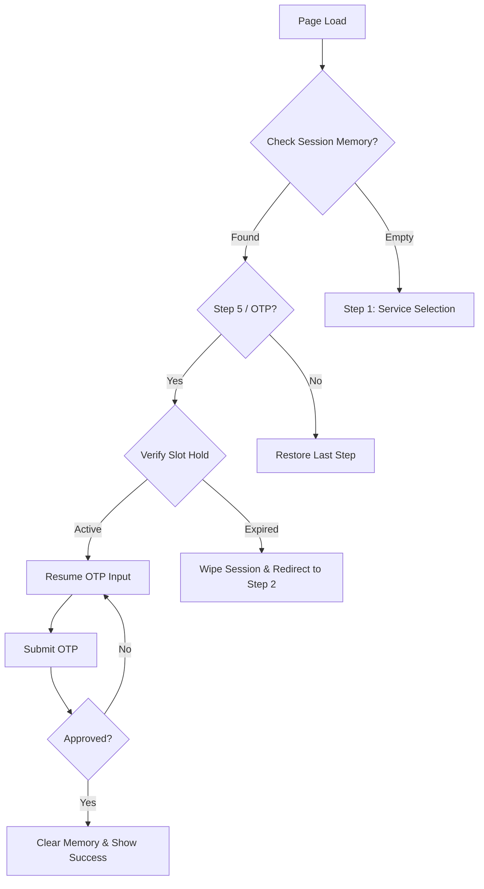

# Guest Booking Resilience & Recovery Architecture

This document outlines the logic and implementation strategy for ensuring the Guest Booking Wizard
is resilient to accidental page reloads, tab closures, and session interruptions.

---

## 🎯 Objectives

1. **Zero Data Loss:** Prevent users from re-entering information after an accidental refresh.
2. **State Persistence:** Maintain the wizard's current step and form data across browser sessions.
3. **Session Security:** Protect slot holds with a synchronized server-side TTL.
4. **Intuitive Recovery:** Provide a seamless "Resume" experience while handling expired states
   gracefully.

---

## 🛠 Core Logic Flow

---

## 📋 Implementation Details

### 1. Browser Memory (Persistence Layer)

As the user progresses through the wizard, state is mirrored to `sessionStorage`.

- **Scope:** Survives page refreshes but clears on tab close (protects privacy on public computers).
- **Data Points:** `step`, `formData` (name, email, phone, etc.), `verificationToken`, and
  `sessionId`.

### 2. The "Single Source of Truth" Timer

The countdown begins the moment a slot is selected (Step 2/3) and is the **Total Transaction Time**.

- **Consistency:** The timer carries through Step 3 (Info), Step 4 (Review), and Step 5 (OTP).
- **Visual Urgency:** A persistent countdown (e.g., "Finish your booking in 3:00") is shown,
  especially in the final steps.
- **Safety:** Prevents "Timer Mismatch" where the UI says 5 minutes but the backend hold has already
  expired.

### 3. The "Resume" Logic

On initialization, the wizard checks `sessionStorage`.

- **Deep Recovery:** If the user was on **Step 5 (Verification)**, they are dropped back into the
  OTP input box without triggering a new code.
- **Visual Feedback:** A subtle "Resuming your session..." notification ensures the user understands
  why they aren't at the start.

### 4. Slot Lock (Server Protection)

- **Synchronization:** The backend hold duration (currently 5 minutes) is the authoritative clock.
- **Pre-Check:** Before transitioning from Step 4 (Review) to Step 5 (OTP), the system performs a
  silent check. If the hold has already expired, the user is redirected to the calendar immediately
  instead of sending a useless OTP.

### 4. Guard Rails & Redirections

| Scenario                | Action                             | UX Outcome                                                |
| :---------------------- | :--------------------------------- | :-------------------------------------------------------- |
| **Accidental Refresh**  | Load `sessionStorage`              | User stays on the same step.                              |
| **Manual "Start Over"** | `clearStorage()` + `releaseHold()` | User returns to Step 1 fresh.                             |
| **Near-Expiry (< 1m)**  | Visual Warning                     | "Time is running out! Please enter the code quickly."     |
| **Expired Slot (0:00)** | `clearStorage()`                   | Automatic redirect to Step 2 with "Slot Expired" message. |
| **Service Conflict**    | Compare URL params vs. Saved State | Prompt: "Continue existing booking or start new?"         |

---

## 💡 UX Enhancements

### The "Exit Ramp"

On the **OTP Screen (Step 5)**, a secondary action is provided:

- **Button:** "Start Over" or "Change Appointment Details".
- **Effect:** Immediately purges session memory and releases the server-side hold.

### The Conflict Resolver (Trigger Threshold)

The modal popup logic depends on whether a "Transaction" has technically started. It is strictly
designed to prevent "slot hoarding" (where a user clicks times, reloads, and clicks different times,
inadvertently blocking hours of clinic time).

| User State                    | Action on Re-entry | Logic                                                                                                                                                     |
| :---------------------------- | :----------------- | :-------------------------------------------------------------------------------------------------------------------------------------------------------- |
| **Step 1 (Service selected)** | Start Fresh        | No popup needed. Selecting a service is low-effort and doesn't block the clinic's calendar.                                                               |
| **Step 2 (Time SELECTED)**    | Show Popup         | **Crucial.** A hold is active. If they start a "New" booking without clearing the old one, they occupy two slots on the calendar until the first expires. |
| **Step 3 & 4 (Info/Review)**  | Show Popup         | **Crucial.** They have already spent time typing their name/phone. Resuming saves them from frustration.                                                  |
| **Step 5 (OTP)**              | Show Popup         | **Mandatory.** This is the highest level of intent. They are one code away from finishing.                                                                |

#### Re-entry Detection Flow:

If the user returns or refreshes while a session is cached:

1. **Verification:** The app checks state and pings the backend via the `slotHold` hook: _"Is the
   hold for this session still active?"_
2. **The Modal:**
    - _If Active:_ "You were looking at [Date] @ [Time]. Would you like to continue booking this
      time or pick a different one?"
    - _If Expired:_ "Your previous selection expired. Please choose a new time." (Redirects to a
      fresh Step 2).

#### The "Start New" Consequence (Silent Cleanup)

When the user clicks "Start New" on the active modal, the system must perform a Silent Cleanup to
prevent calendar bloat:

1. **Step 1:** Call the backend to `releaseHold(old_slot_id)`. This immediately opens that slot for
   other patients.
2. **Step 2:** Wipe the `sessionStorage`.
3. **Step 3:** Redirect to Step 1 fresh.

---

## 🛠 Safe Implementation Strategy

Given the current architecture, this can be safely implemented piece by piece without backend
disruption:

### Phase 1: Database & Backend Verification

> **Good News:** Your backend is already 100% ready for this. No database schema changes or new
> Express routes required. The `slot_holds` table (Table 25) with its `user_session_id` and the
> `checkActiveHold` methods already provide the necessary API support. The backend inherently
> supports releasing holds early via `releaseHold()`.

### Phase 2: Frontend Data Persistence (`useGuestBooking.js`)

1. **Storage Tier Upgrade (`localStorage` vs `sessionStorage`)**
    - To allow users to accidentally close Chrome and still trigger the "Unfinished Booking"
      recovery, change the storage layer from `sessionStorage` to **`localStorage`**.
    - Replace references to `sessionStorage` with `localStorage` for the `guest_session_id`.

2. **State Synchronization**
    - Hook into the existing state. Stringify and save `formData`, `step`, and `verificationToken`
      to `localStorage` (e.g., key: `guest_booking_state`) on every change (within `updateField` and
      `updateFields`).
    - On initialization (`useEffect`), load from this storage instead of hardcoded defaults if a
      valid state structure exists. This directly prevents the `useEffect` on Step 3 from
      accidentally releasing the hold on refresh because the `service_id` will be correctly
      repopulated.

### Phase 3: The Re-entry Interceptor (`GuestBookingWizard.jsx`)

1. **Sync Slot Expiry on Initialization**
    - When `GuestBookingWizard` mounts, if it detects `guest_booking_state` from `localStorage`
      indicating the user is past Step 1, fire a check to `slotHold.checkActiveHold()`.
2. **Implement The Conflict Resolver Modal**
    - Build the Modal component: _"You have an unfinished booking for [Date] @ [Time]. Would you
      like to continue or start fresh?"_
    - **"Continue":** Dismiss modal, drop user onto their restored `step` with restored `formData`.
      If on Step 5, they can immediately enter their OTP.
    - **"Start Fresh" (Silent Cleanup):** Execute `slotHold.releaseHold()` (if hold exists),
      `localStorage.removeItem('guest_booking_state')`,
      `localStorage.removeItem('guest_session_id')`, call `reset()`, and drop user at Step 1
      (`step === 0`).
3. **Handle Expired Gracefully**
    - If `!slotHold.activeHold` (hold expired on the backend) but they were on Step 3, 4, or 5:
      reset to Step 2 (DateTime) automatically and clear the cached form progress past that point,
      showing a toast: _"Your slot hold expired. Please select a new time."_

### Phase 4: UI/UX Refinements (Components)

1. **Extract the Countdown / Global Timer (`DateTimeStep.jsx` & `GuestBookingWizard.jsx`)**
    - The global lock UI logic currently sits in `DateTimeStep.jsx` (showing the hold pulse/progress
      bar).
    - Float the `timeRemaining` UI rendering into the `<header>` of `GuestBookingWizard.jsx` so the
      timer visibly persists globally across Step 3 (Info), Step 4 (Review), and Step 5 (OTP).
2. **Exit Ramps Updates (`OTPStep.jsx`)**
    - Wire a new "Start Over" button on `OTPStep.jsx` to trigger `booking.reset()`, which perfectly
      maps to your current robust logic that clears the ID, wipes the form, and releases slot holds.

---

## 🚀 What to Expect When Finished (Scenarios)

Once implemented, here is exactly how the system will behave:

| Scenario                                     | System Behavior                                                                                                                                                                                                                              |
| :------------------------------------------- | :------------------------------------------------------------------------------------------------------------------------------------------------------------------------------------------------------------------------------------------- |
| **Accidental Refresh on Step 4 (Review)**    | The page reloads. `sessionStorage` kicks in, restoring the `formData` and putting the user right back on Step 4. The timer in the header continues counting down continuously.                                                               |
| **Accidental Refresh on Step 5 (OTP)**       | The page reloads and drops the user back directly into the OTP input box. It does **not** send a new email (preventing spam). They enter the code they already received.                                                                     |
| **User takes too long on the OTP step**      | The global timer runs out. The system detects the slot hold has expired via the synchronization. The wizard dynamically kicks the user back to Step 2 (Date/Time) with a polite toast: _"Your slot hold expired. Please select a new time."_ |
| **User decides to change service on Step 5** | They click a new "Start Over" or "Go Back" interaction explicitly on the OTP screen. The system fully releases the backend hold so someone else can book it, wipes `sessionStorage`, and transitions the user cleanly.                       |
| **Global Persistent Countdown**              | A progress bar/timer appears in the sticky navigation bar across all steps after selecting a time, creating a unified sense of urgency (e.g., _"Hold Active: 04:59 left"_), guaranteeing the user realizes the slot is temporarily locked.   |

---

## 🧪 Verification Scenarios (Testing Guide)

Perform these tests to ensure the resilience logic is performing as architected:

### 1. The "Safety Net" (Basic Persistence)

- **Action:** Go to **Step 3 (Info)** and fill in your name and email. **Refresh the page.**
- **Expected:** You should be greeted by the **Recovery Modal**. Clicking "Continue" should keep you on Step 3 with all your typed information restored.
- **Action:** Go to **Step 2 (Date/Time)**, select a slot. **Refresh the page.**
- **Expected:** You should see the **Recovery Modal** even on Step 2. Clicking "Continue" should restore your slot and show the countdown timer.WORKINGGGGGGGGGGG

it works now and also when i reload i can see that it propmp if i continue or not and if ireset it reset the hold also no then keep it like this for now.

what i did not test is if example the hold is already finnised then what will be hte pop up like your hold is expired or something then pick time again it to do later.

### 2. The "Resume" Logic (OTP Recovery)

- **Action:** Go to **Step 5 (Verification)** so the email is sent. **Refresh the page.**
- **Expected:** You are dropped directly back into the OTP input box. **Crucially**, no second email
  should be sent. Enter the code from the first email to finish.

### 3. The "Conflict Resolver" Modal

- **Action:** Select a time (Step 2), go to Step 3, and **Refresh**.
- **Expected:** A high-fidelity modal appears: _"Unfinished Booking Found... Continue or Start Fresh?"_
- **Test "Continue":** Modal closes, you stay on Step 3 with your data restored.
- **Test "Start Fresh":** The system should call the backend to **release the hold**, clear everything, and drop you back at Step 1 (Service). Verify that the released slot becomes available immediately.

its working, ### 3. The "Conflict Resolver" Modal

### 4. The "Silent Expiry" (Security Guard)

- **Action:** Select a time (Step 2), go to Step 3, and **Wait 30 seconds** (Current test timeout).
- **Expected:** A high-fidelity **"Session Expired" Modal** (Amber theme) appears.
- **Verification:** 
    - The system should automatically redirect you to **Step 2 (Date/Time)** in the background.
    - All date/time fields should be **cleared**.
    - Clicking **"PICK NEW TIME"** in the modal closes it and allows you to select a fresh slot immediately.

- **Action:** Select a time. Wait for the 5-minute timer to run out (0:00). **Refresh the page.**
- **Expected:** The app should detect the hold is dead. You should be automatically redirected to
  **Step 2 (Date/Time)** with a toast notification: _"Your previous session expired. Please select a
  new time."_

### 5. The "Global Urgency" (Timer Sync)

- **Action:** Progress from Step 3 to Step 4 to Step 5.
- **Expected:** Look at the header. The **"Hold Active"** countdown must stay visible and perfectly
  synchronized across all three steps.

### 6. The "Clean Exit" (Manual Release)

- **Action:** On the **OTP Screen**, click the new **"Start Over (Release Hold)"** button.
- **Expected:** Verify in the database (`slot_holds` table) that the hold status changes to
  `released` immediately, and you are returned to Step 1.

### 7. The "Hard Closure" (Browser Restart Recovery)

- **Action:** Reach **Step 4 (Review)**. **Close your browser entirely (all tabs).** Re-open and
  navigate back to the booking page.
- **Expected:** You should be greeted by the **Recovery Modal**. Clicking "Continue" should restore
  all your data and the countdown timer, exactly as it was before you closed the browser.
