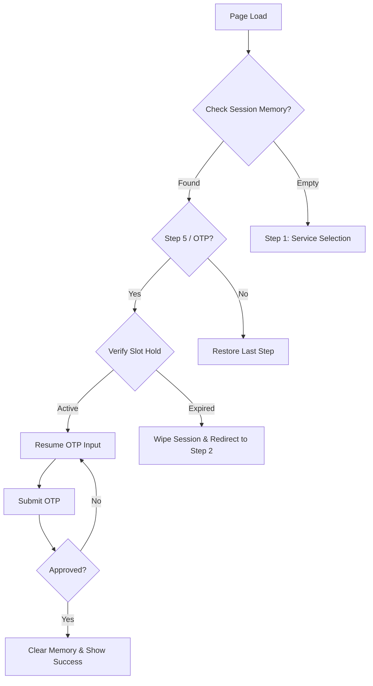

# Guest Booking Resilience & Recovery Architecture

This document outlines the logic and implementation strategy for ensuring the Guest Booking Wizard is resilient to accidental page reloads, tab closures, and session interruptions.

---

## 🎯 Objectives
1. **Zero Data Loss:** Prevent users from re-entering information after an accidental refresh.
2. **State Persistence:** Maintain the wizard's current step and form data across browser sessions.
3. **Session Security:** Protect slot holds with a synchronized server-side TTL.
4. **Intuitive Recovery:** Provide a seamless "Resume" experience while handling expired states gracefully.

---

## 🛠 Core Logic Flow

---

## 📋 Implementation Details

### 1. Browser Memory (Persistence Layer)
As the user progresses through the wizard, state is mirrored to `sessionStorage`.
- **Scope:** Survives page refreshes but clears on tab close (protects privacy on public computers).
- **Data Points:** `step`, `formData` (name, email, phone, etc.), `verificationToken`, and `sessionId`.

### 2. The "Single Source of Truth" Timer
The countdown begins the moment a slot is selected (Step 2/3) and is the **Total Transaction Time**.
- **Consistency:** The timer carries through Step 3 (Info), Step 4 (Review), and Step 5 (OTP).
- **Visual Urgency:** A persistent countdown (e.g., "Finish your booking in 3:00") is shown, especially in the final steps.
- **Safety:** Prevents "Timer Mismatch" where the UI says 5 minutes but the backend hold has already expired.

### 3. The "Resume" Logic
On initialization, the wizard checks `sessionStorage`.
- **Deep Recovery:** If the user was on **Step 5 (Verification)**, they are dropped back into the OTP input box without triggering a new code.
- **Visual Feedback:** A subtle "Resuming your session..." notification ensures the user understands why they aren't at the start.

### 4. Slot Lock (Server Protection)
- **Synchronization:** The backend hold duration (currently 5 minutes) is the authoritative clock.
- **Pre-Check:** Before transitioning from Step 4 (Review) to Step 5 (OTP), the system performs a silent check. If the hold has already expired, the user is redirected to the calendar immediately instead of sending a useless OTP.

### 4. Guard Rails & Redirections

| Scenario | Action | UX Outcome |
| :--- | :--- | :--- |
| **Accidental Refresh** | Load `sessionStorage` | User stays on the same step. |
| **Manual "Start Over"** | `clearStorage()` + `releaseHold()` | User returns to Step 1 fresh. |
| **Near-Expiry (< 1m)** | Visual Warning | "Time is running out! Please enter the code quickly." |
| **Expired Slot (0:00)** | `clearStorage()` | Automatic redirect to Step 2 with "Slot Expired" message. |
| **Service Conflict** | Compare URL params vs. Saved State | Prompt: "Continue existing booking or start new?" |

---

## 💡 UX Enhancements

### The "Exit Ramp"
On the **OTP Screen (Step 5)**, a secondary action is provided:
- **Button:** "Start Over" or "Change Appointment Details".
- **Effect:** Immediately purges session memory and releases the server-side hold.

### The Conflict Resolver
If a user clicks a *new* booking link while a session is already active:
- **Modal:** "You have an unfinished booking for [Service] on [Date]. Would you like to continue or start fresh?"
- **Benefit:** Prevents accidental double-bookings and orphaned slot holds.

---

> [!TIP]
> This architecture ensures that the "Happy Path" is frictionless while the "Unhappy Path" (expiry/conflicts) is handled with clear, automated guidance.
